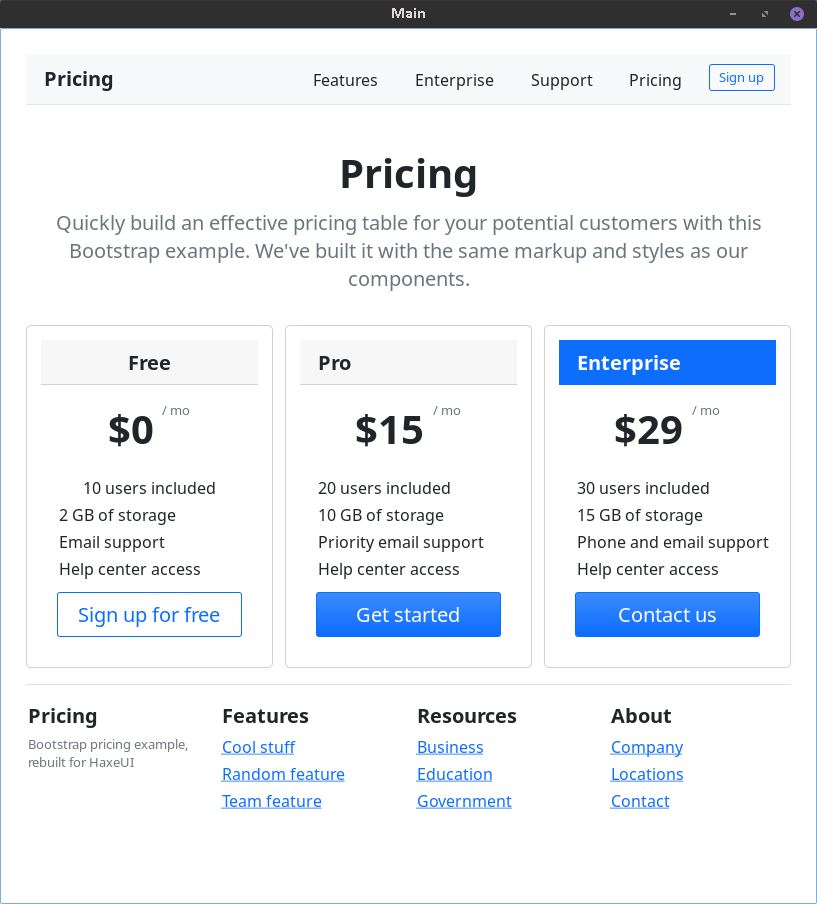
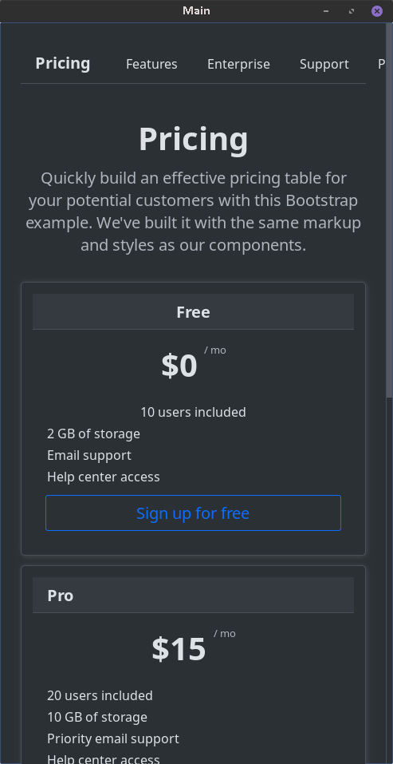

# haxeui-bootstrap-theme

Bootstrap 5 theme and a reactstrap-style component library for [HaxeUI](https://github.com/haxeui/haxeui-core).

Light and dark themes, a responsive 12-column grid, and `bs.*` components that let you build UI the reactstrap way — with props instead of hand-written CSS classes.




## Features

- **Bootstrap 5 look & feel** for HaxeUI: typography, buttons, forms, alerts, badges, cards, breadcrumb, pagination, navbar, tabs, accordion, modals, dropdowns, tooltips
- **Light & dark themes** with runtime switching (`Toolkit.theme = "dark"`)
- **Responsive 12-column grid** with breakpoints (`col-6`, `col-md-4`, `d-md-none`, …) via CSS media queries
- **reactstrap-style components**: `<bsbutton variant="success" size="lg" />`, `<bsalert variant="info">`, `<bsmodal>`, …
- **Utility classes**: spacing (`p-1…p-5`), colors (`text-*`, `bg-*`), borders (`border`, `rounded`, `rounded-pill`), display (`d-none`, `d-md-block`)
- **Custom CSS function** `rgba(#000000, 0.175)` registered through `<cssExtensions>`

## Installation

```bash
haxelib install haxeui-bootstrap-theme
```

Development version:

```bash
haxelib git haxeui-bootstrap-theme https://github.com/egrrorr-cyber/haxeui-bootstrap-theme.git
```

In your `project.xml` / `application.xml`:

```xml
<haxelib name="haxeui-openfl" />
<haxelib name="haxeui-bootstrap-theme" />
```

## Quick start

```haxe
import haxe.ui.Toolkit;

Toolkit.init();
Toolkit.theme = "bootstrap";   // or "dark"
```

Plain HaxeUI components with Bootstrap classes:

```xml
<button text="Save" styleNames="btn-primary btn-lg" />
<vbox styleNames="alert alert-danger"><label text="Something went wrong" /></vbox>
```

Or the component API:

```xml
<bsbutton text="Save" variant="primary" size="lg" />
<bsalert variant="danger"><label text="Something went wrong" /></bsalert>
<bsbadge text="99" variant="danger" pill="true" />
```

## Components

| Tag | Props | Bootstrap analog |
|---|---|---|
| `<bsbutton>` | `variant`, `outline`, `size` | Button |
| `<bsalert>` | `variant` | Alert |
| `<bsbadge>` | `variant`, `pill` | Badge |
| `<bscard>` + `<bscardheader/body/footer/title/text>` | — | Card |
| `<bsbreadcrumb>` + `<bsbreadcrumbitem>` | `active` | Breadcrumb |
| `<bspagination>` | `pages`, `current` | Pagination |
| `<bscontainer>` / `<bsrow>` / `<bscol>` | `cols`, `sm`, `md`, `lg` | Container / Row / Col |
| `<bsdropdown>` | `items` | Dropdown |
| `<bsmodal>` | `title`, `addFooter()`, `open()`, `close_()` | Modal |

## Containers, block-flow and text wrapping

### Containers
- `<bscontainer>` — Bootstrap `.container`: fluid below 576px, then the fixed-width
  ladder 540/720/960/1140/1320 (pure CSS `@media`), auto-centered.
- `<bscontainerfluid>` — `.container-fluid`: always 100%.
- Page-root pattern: wrap pages in `<bscontainerfluid>` to get HTML-like block flow.

### Block-flow emulation
HTML block children stretch; HaxeUI children are auto-width by default.
The theme emulates block flow for direct children of containers
(enumerated selector block in `_grid.css`). Children with an explicit width
keep it — set explicit widths inside containers via inline style
(`style="width: 320"`), not the `width="320"` attribute (stylesheet beats attributes).

### Text wrapping
Labels wrap only when their width is constrained. Use Bootstrap-named utilities:
`<label text="..." styleNames="text-wrap w-100" />`.

### HaxeUI gotchas (theme-level workarounds)
1. `max-width` from `@media` on a percent-width component → infinite layout loop
   (100% CPU). The container ladder therefore uses fixed `width` values.
2. Duplicated width sources (code `percentWidth` + CSS `width`) → syncValidation loop.
   Components keep a single width source.
3. The universal selector `*` matches every component regardless of ancestors
   (core `ruleMatch` returns true before the parent check), so `.x > *` rules go
   global. Block-flow enumerates node names instead; upstream issue pending.
   
### Grid example

```xml
<bsrow>
    <bscol md="8"><label text="content" /></bscol>
    <bscol md="4"><label text="sidebar" /></bscol>
</bsrow>
```

### Modal example

```haxe
var modal = new BSModal();
modal.title = "Confirm action";
modal.addComponent(new Label()).text = "Do you really want to continue?";

var ok = new BSButton();
ok.text = "Yes";
ok.onClick = function(_) modal.close_();
modal.addFooter(ok);

modal.open();
```

## Demo

A full showcase (typography, all components, responsive grid, and a rebuild of the [Bootstrap pricing example](https://getbootstrap.com/docs/4.0/examples/pricing/)) lives in [`test/`](test/):

```bash
haxelib dev haxeui-bootstrap-theme .
cd test
openfl test hl
```

## Tested backends

| Backend | Status | Notes |
|---|---|---|
| `haxeui-openfl` (HL) | ✅ fully tested | |
| `haxeui-openfl` (Linux native) | ✅ fully tested | |
| `haxeui-openfl` (HTML5) | ✅ fully tested | |
| `haxeui-heaps` (HL) | ⚠️ partially working | needs a TTF with your glyphs; `rounded-pill` renders artifacts |

## License

MIT